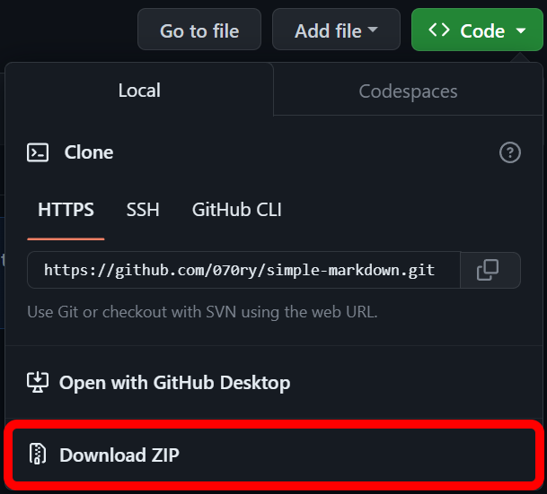

# [Simple Markdown](https://github.com/070ry/simple-markdown)
**made by [070ry](https://github.com/070ry)**

# 概要
こういうの初めて作ったのでどこか変な部分があってもどうかお許しを

# Todo
- [x] コピーボタンを作る
- [ ] 使用できるスタイルを増やす(取り消し線、アンダーラインなど)
- [ ] コードブロックを作れるようにする
- [ ] 画像を貼れるようにする(現在はhtmlタグで可能)
- [ ] 引用文を作れるようにする

# 使い方
1. まずソースコードをダウンロードします

- Githubから直接ダウンロード



ダウンロードしたファイルを解凍します。


- Gitを使用してダウンロード
```
git clone https://github.com/070ry/simple-markdown.git
```

2. 依存関係をインストールする
プロジェクトのルートディレクトリで
```
npm install
```
を実行してください。

3. markdown.md内に内容を書きます。

サポートされている構文
- \*\*TEXT\*\*: **太字(Bold)**
- \*TEXT\*: *斜体(Italic)*
- \# Text: Header
- \#\# Text: Header2
- \-Text: List

4. プロジェクトのルートディレクトリで
```
node dist/main
```
もしくは`run.bat`か`run.sh`を実行する

5. markdown.htmlに内容が書き出される。
